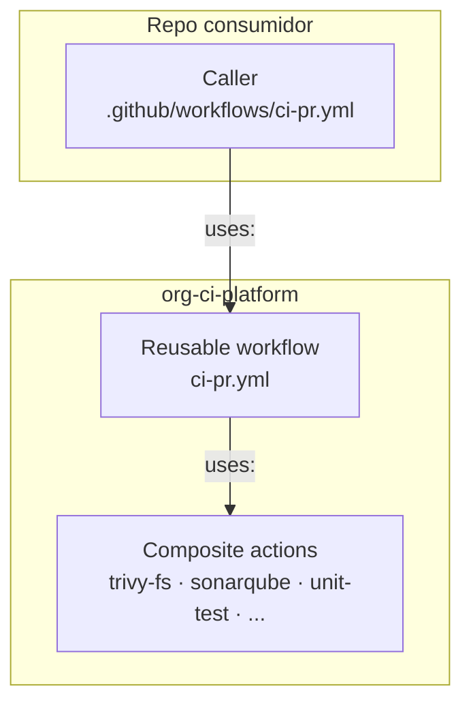
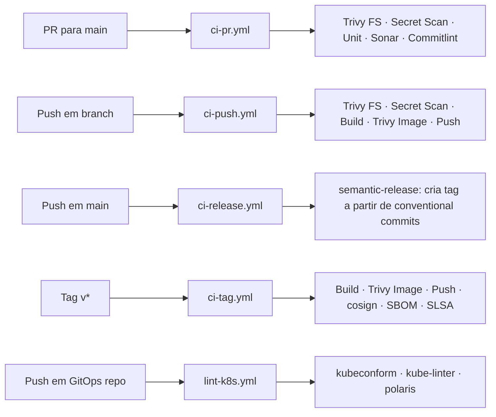
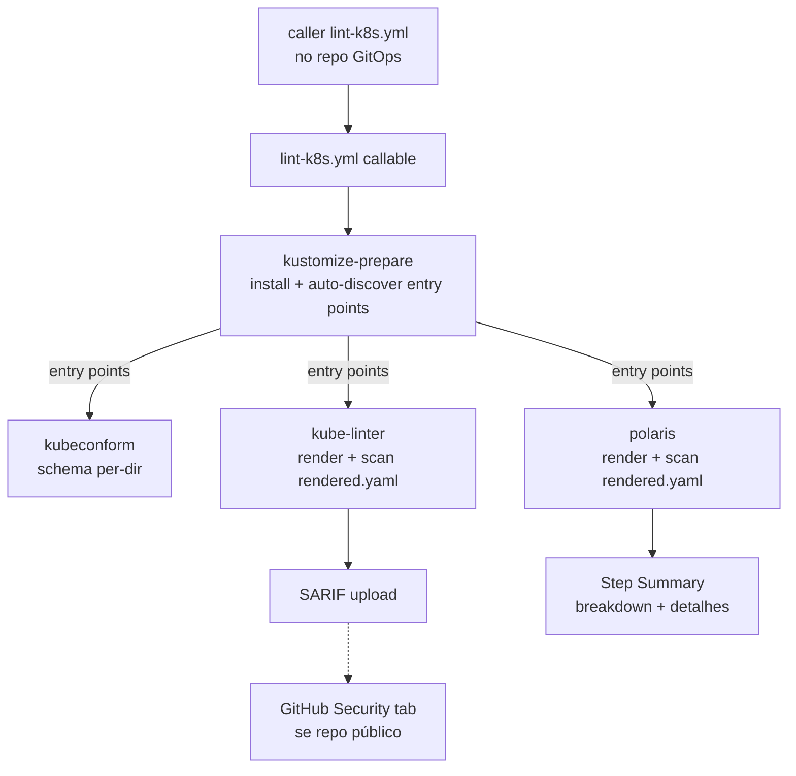
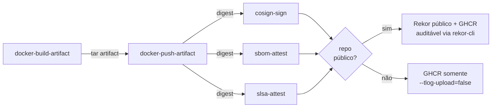

# Architecture — org-ci-platform

## Overview

`org-ci-platform` é uma plataforma interna de CI: composite actions de
responsabilidade única, encadeadas em reusable workflows por evento,
consumidas por callers minimalistas no projeto final.

A intenção é tratar CI como **produto interno** — quando um repo novo
nasce, o time copia 4 callers e ganha pipeline completo (test, scan,
build, sign, attest) sem reescrever lógica.

Esse documento foca em **decisões de design** e **diagramas**. Pra "o
que existe" e "como usar", ver [README.md](README.md).

---

## Camadas



**Por que 3 camadas em vez de uma?**

- **Composite action** = um passo lógico (escaneia, builda, assina). Reutilizável fora do contexto desta pipeline.
- **Reusable workflow** = orquestração por evento (qual passo roda, em que ordem, com que `needs:`). Específico do fluxo da plataforma.
- **Caller** = adapter no repo consumer. Define o `on:` do evento e secrets/vars que o reusable workflow precisa.

Misturar orquestração e ação na mesma camada (workflows monolíticos com
muitos `if:` por evento) gera arquivos longos onde lógicas de eventos
diferentes se contaminam.

---

## Pipeline por evento



`ci-release` cria a tag mas **não** dispara `ci-tag` por padrão — GitHub
proíbe workflow disparar workflow via `GITHUB_TOKEN` (anti-loop). Pra
disparar, `ci-release` precisa de `RELEASE_APP_*` (GitHub App) e usa
`actions/create-github-app-token` pra empurrar a tag com identidade do App.

---

## Lint K8s pipeline (repos GitOps)



**Auto-discovery filtra kustomizations referenciadas como base.**
Sem isso, `base/` e `overlays/lab/` viram ambos entry points — `base`
renderizada standalone (sem newTag, sem patches) gera findings duplicados
e falsos. Lógica em
[`kustomize-prepare/action.yml`](.github/actions/kustomize-prepare/action.yml).

**Render-then-scan padroniza patches strategic-merge.** Patches são
fragmentos parciais — escanear o YAML cru gera falsos positivos
(`securityContext` vazio, `resources` ausentes que o merge preencheria).
kube-linter e Polaris operam sobre `kustomize build`; kubeconform mantém
per-dir porque schema validation é isolada por dir.

---

## Supply chain (ci-tag)



Build → push → 3 attestations independentes sobre o **digest** (não
sobre a tag, que é mutável). Tudo via cosign keyless — cert efêmero do
Fulcio via OIDC do GitHub Actions, sem chave persistente.

---

## Decisões de design

### Per-event em vez de workflow único com `if:`

**Escolha:** um arquivo callable por evento (`ci-pr`, `ci-push`,
`ci-release`, `ci-tag`).

**Alternativa:** workflow monolítico com jobs gateados por
`if: github.event_name == 'X'`.

**Por quê:** árvore de condicionais misturando lógicas de eventos
diferentes no mesmo arquivo polui leitura e dificulta debug. Cada
arquivo per-event tem responsabilidade única e cabe na cabeça.

**Custo:** caller copia 4-5 arquivos no repo consumidor. É boilerplate
real, mas o conteúdo de cada caller é trivial (5-10 linhas) e bem
templatizado.

### SHA pinning com comentário de versão

**Escolha:** todas third-party actions pinadas por SHA do commit + comentário `# vX.Y.Z`.

```yaml
uses: aquasecurity/trivy-action@ed142fd0673e97e23eac54620cfb913e5ce36c25 # v0.36.0
```

**Alternativa:** pinar por tag (`@v0.36.0`).

**Por quê:** tags são mutáveis. Caso canônico é
[tj-actions/changed-files em 2024](https://github.com/tj-actions/changed-files/issues/2463),
onde tags foram reescritas pra apontar pra commit malicioso. SHA é
imutável; comentário mantém leitura humana.

**Custo:** Dependabot precisa estar configurado pra bumpar SHA + comentário
(arquivo `.github/dependabot.yml`).

### Gate via OPA Rego em vez de `--severity` do Trivy

**Escolha:** policy.rego custom pra cada action de Trivy. Filtra
UNKNOWN/LOW/MEDIUM antes do `--exit-code` mas mantém todas no output.

**Alternativa:** `--severity HIGH,CRITICAL`.

**Por quê:** o flag `--severity` filtra display E gate juntos. Quem ler
o log só vê HIGH/CRITICAL — perde visibilidade de tendência (LOW que
hoje é ignorável pode escalar). Rego desacopla "o que mostro" de "o que
falho".

**Custo:** mais um arquivo (`policy.rego`) por action de Trivy. Pra
mudar threshold, edita policy ou forka a action.

### `--tlog-upload` adapta por visibilidade do repo

**Escolha:** detecta `github.event.repository.visibility` em runtime; se
público, sobe assinaturas/attestations pro Rekor; se privado,
`--tlog-upload=false`.

**Alternativa fora-da-caixa:**
`actions/attest-build-provenance@v1` (sempre publica no Rekor público).

**Por quê:** a action oficial não tem flag pra desligar Rekor. Repo
privado com Rekor público vaza metadados (workflow ref, commit SHA,
imagem assinada) — quebra o ponto de ser privado.

**Custo:** caminho cosign manual em vez do componente off-the-shelf.
Em produção real, a única diferença seria trocar `cosign keyless` por
`cosign sign --key awskms://...` (KMS) — arquitetura idêntica.

---

## Limitações conhecidas

### Hoje, dentro do escopo atual

- **Sem CVE scan das images referenciadas em manifests GitOps.**
  `lint-k8s.yml` valida config dos manifests mas não escaneia
  vulnerabilidades das images que eles apontam — CVE crítico em
  `quay.io/keycloak/keycloak:26.6.1` passa silencioso. Reaproveitamento
  da action `trivy-image` planejado.

### Se a stack mudar, viram limitação

- **Pipeline lê apenas Kustomize.** Adotar Helm chart em algum repo
  (ex.: `cert-manager`) ou raw YAMLs sem `kustomization.yaml` exigiria
  estender o `kustomize-prepare` — `helm template` ou fallback de
  YAMLs crus. Hoje não há.
- **Argo CD ApplicationSet generators não-lintáveis.** Matrix/Git/Cluster
  generators renderizam manifests em runtime — fundamentalmente
  impossível lintar estaticamente sem cluster. Hoje não há
  ApplicationSet em uso.
